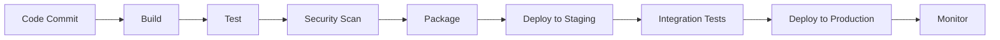

# CI/CD Pipeline Automation: From Code to Production

Continuous Integration and Continuous Deployment (CI/CD) pipelines are the backbone of modern software delivery. This guide covers everything from pipeline design to advanced deployment strategies.

## Pipeline Architecture Overview

A well-designed CI/CD pipeline consists of several stages:



## Jenkins Pipeline Implementation

### 1. Declarative Pipeline Structure

```groovy
// Jenkinsfile
pipeline {
    agent any
    
    environment {
        DOCKER_REGISTRY = 'your-registry.com'
        IMAGE_TAG = "${env.BUILD_NUMBER}"
    }
    
    stages {
        stage('Checkout') {
            steps {
                checkout scm
            }
        }
        
        stage('Build') {
            steps {
                sh 'docker build -t ${DOCKER_REGISTRY}/app:${IMAGE_TAG} .'
            }
        }
        
        stage('Test') {
            parallel {
                stage('Unit Tests') {
                    steps {
                        sh 'docker run --rm ${DOCKER_REGISTRY}/app:${IMAGE_TAG} npm test'
                    }
                }
                stage('Integration Tests') {
                    steps {
                        sh 'docker run --rm ${DOCKER_REGISTRY}/app:${IMAGE_TAG} npm run test:integration'
                    }
                }
            }
        }
        
        stage('Security Scan') {
            steps {
                sh 'docker run --rm -v /var/run/docker.sock:/var/run/docker.sock aquasec/trivy image ${DOCKER_REGISTRY}/app:${IMAGE_TAG}'
            }
        }
        
        stage('Deploy to Staging') {
            when {
                branch 'develop'
            }
            steps {
                sh 'kubectl set image deployment/app app=${DOCKER_REGISTRY}/app:${IMAGE_TAG} -n staging'
            }
        }
        
        stage('Deploy to Production') {
            when {
                branch 'main'
            }
            steps {
                sh 'kubectl set image deployment/app app=${DOCKER_REGISTRY}/app:${IMAGE_TAG} -n production'
            }
        }
    }
    
    post {
        always {
            cleanWs()
        }
        failure {
            emailext (
                subject: "Build Failed: ${env.JOB_NAME} - ${env.BUILD_NUMBER}",
                body: "Build failed. Check console output for details.",
                to: "${env.CHANGE_AUTHOR_EMAIL}"
            )
        }
    }
}
```

### 2. Multi-Branch Pipeline Configuration

```groovy
// Multibranch Pipeline
pipeline {
    agent none
    
    stages {
        stage('Build and Test') {
            agent {
                kubernetes {
                    yaml """
apiVersion: v1
kind: Pod
spec:
  containers:
  - name: node
    image: node:18
    command:
    - cat
    tty: true
  - name: docker
    image: docker:dind
    securityContext:
      privileged: true
"""
                }
            }
            steps {
                container('node') {
                    sh 'npm install'
                    sh 'npm test'
                }
                container('docker') {
                    sh 'docker build -t app:${BUILD_NUMBER} .'
                }
            }
        }
    }
}
```

## GitLab CI/CD Implementation

### 1. Comprehensive GitLab CI Pipeline

```yaml
# .gitlab-ci.yml
stages:
  - build
  - test
  - security
  - package
  - deploy-staging
  - deploy-production

variables:
  DOCKER_DRIVER: overlay2
  DOCKER_TLS_CERTDIR: "/certs"
  IMAGE_TAG: $CI_REGISTRY_IMAGE:$CI_COMMIT_SHA

services:
  - docker:dind

before_script:
  - docker login -u $CI_REGISTRY_USER -p $CI_REGISTRY_PASSWORD $CI_REGISTRY

build:
  stage: build
  script:
    - docker build -t $IMAGE_TAG .
    - docker push $IMAGE_TAG
  only:
    - branches

test:unit:
  stage: test
  image: node:18
  script:
    - npm install
    - npm run test:unit
  coverage: '/Lines\s*:\s*(\d+\.\d+)%/'
  artifacts:
    reports:
      coverage_report:
        coverage_format: cobertura
        path: coverage/cobertura-coverage.xml

test:integration:
  stage: test
  image: $IMAGE_TAG
  script:
    - npm run test:integration
  services:
    - postgres:13
  variables:
    POSTGRES_DB: test_db
    POSTGRES_USER: test_user
    POSTGRES_PASSWORD: test_password

security:scan:
  stage: security
  image: aquasec/trivy:latest
  script:
    - trivy image --exit-code 1 --severity HIGH,CRITICAL $IMAGE_TAG
  allow_failure: true

deploy:staging:
  stage: deploy-staging
  image: bitnami/kubectl:latest
  script:
    - kubectl config use-context staging
    - kubectl set image deployment/app app=$IMAGE_TAG -n staging
    - kubectl rollout status deployment/app -n staging
  environment:
    name: staging
    url: https://staging.yourcompany.com
  only:
    - develop

deploy:production:
  stage: deploy-production
  image: bitnami/kubectl:latest
  script:
    - kubectl config use-context production
    - kubectl set image deployment/app app=$IMAGE_TAG -n production
    - kubectl rollout status deployment/app -n production
  environment:
    name: production
    url: https://yourcompany.com
  when: manual
  only:
    - main
```

### 2. Advanced GitLab CI Features

```yaml
# Advanced pipeline with caching and parallel jobs
cache:
  key: ${CI_COMMIT_REF_SLUG}
  paths:
    - node_modules/
    - .npm/

variables:
  NODE_ENV: "test"

test:parallel:
  stage: test
  image: node:18
  parallel: 4
  script:
    - npm install
    - npm run test:parallel
  artifacts:
    when: always
    reports:
      junit: test-results.xml
```

## GitHub Actions Implementation

### 1. Comprehensive GitHub Actions Workflow

```yaml
# .github/workflows/ci-cd.yml
name: CI/CD Pipeline

on:
  push:
    branches: [main, develop]
  pull_request:
    branches: [main]

env:
  REGISTRY: ghcr.io
  IMAGE_NAME: ${{ github.repository }}

jobs:
  test:
    runs-on: ubuntu-latest
    strategy:
      matrix:
        node-version: [16, 18, 20]
    
    steps:
    - name: Checkout code
      uses: actions/checkout@v3
      
    - name: Setup Node.js
      uses: actions/setup-node@v3
      with:
        node-version: ${{ matrix.node-version }}
        cache: 'npm'
        
    - name: Install dependencies
      run: npm ci
      
    - name: Run tests
      run: npm test
      
    - name: Upload coverage
      uses: codecov/codecov-action@v3

  security:
    runs-on: ubuntu-latest
    steps:
    - name: Checkout code
      uses: actions/checkout@v3
      
    - name: Run Trivy vulnerability scanner
      uses: aquasecurity/trivy-action@master
      with:
        scan-type: 'fs'
        scan-ref: '.'
        format: 'sarif'
        output: 'trivy-results.sarif'
        
    - name: Upload Trivy scan results
      uses: github/codeql-action/upload-sarif@v2
      with:
        sarif_file: 'trivy-results.sarif'

  build:
    needs: [test, security]
    runs-on: ubuntu-latest
    if: github.ref == 'refs/heads/main' || github.ref == 'refs/heads/develop'
    
    steps:
    - name: Checkout code
      uses: actions/checkout@v3
      
    - name: Set up Docker Buildx
      uses: docker/setup-buildx-action@v2
      
    - name: Log in to Container Registry
      uses: docker/login-action@v2
      with:
        registry: ${{ env.REGISTRY }}
        username: ${{ github.actor }}
        password: ${{ secrets.GITHUB_TOKEN }}
        
    - name: Extract metadata
      id: meta
      uses: docker/metadata-action@v4
      with:
        images: ${{ env.REGISTRY }}/${{ env.IMAGE_NAME }}
        tags: |
          type=ref,event=branch
          type=sha,prefix={{branch}}-
          
    - name: Build and push Docker image
      uses: docker/build-push-action@v4
      with:
        context: .
        push: true
        tags: ${{ steps.meta.outputs.tags }}
        labels: ${{ steps.meta.outputs.labels }}

  deploy:
    needs: build
    runs-on: ubuntu-latest
    if: github.ref == 'refs/heads/main' || github.ref == 'refs/heads/develop'
    
    steps:
    - name: Deploy to Kubernetes
      uses: azure/k8s-deploy@v1
      with:
        manifests: |
          k8s/deployment.yaml
          k8s/service.yaml
        images: |
          ${{ env.REGISTRY }}/${{ env.IMAGE_NAME }}:${{ github.sha }}
        kubeconfig: ${{ secrets.KUBE_CONFIG }}
```

## Deployment Strategies

### 1. Blue-Green Deployment

```yaml
# blue-green-deployment.yaml
apiVersion: argoproj.io/v1alpha1
kind: Rollout
metadata:
  name: app-rollout
spec:
  replicas: 5
  strategy:
    blueGreen:
      activeService: app-active
      previewService: app-preview
      autoPromotionEnabled: false
      scaleDownDelaySeconds: 30
      prePromotionAnalysis:
        templates:
        - templateName: success-rate
        args:
        - name: service-name
          value: app-preview
      postPromotionAnalysis:
        templates:
        - templateName: success-rate
        args:
        - name: service-name
          value: app-active
  selector:
    matchLabels:
      app: app
  template:
    metadata:
      labels:
        app: app
    spec:
      containers:
      - name: app
        image: app:latest
        ports:
        - containerPort: 8080
```

### 2. Canary Deployment

```yaml
# canary-deployment.yaml
apiVersion: argoproj.io/v1alpha1
kind: Rollout
metadata:
  name: app-canary
spec:
  replicas: 5
  strategy:
    canary:
      steps:
      - setWeight: 20
      - pause: {duration: 10m}
      - setWeight: 40
      - pause: {duration: 10m}
      - setWeight: 60
      - pause: {duration: 10m}
      - setWeight: 80
      - pause: {duration: 10m}
      analysis:
        templates:
        - templateName: success-rate
        args:
        - name: service-name
          value: app-canary
```

## Quality Gates and Automation

### 1. Automated Testing Gates

```groovy
// Quality gates in Jenkins
pipeline {
    stages {
        stage('Quality Gate') {
            steps {
                script {
                    def qualityGate = waitForQualityGate()
                    if (qualityGate.status != 'OK') {
                        error "Quality gate failed: ${qualityGate.status}"
                    }
                }
            }
        }
    }
}
```

### 2. Performance Testing Integration

```yaml
# Performance testing in GitLab CI
performance:test:
  stage: test
  image: loadimpact/k6:latest
  script:
    - k6 run performance-tests/load-test.js
  artifacts:
    reports:
      performance: performance-report.json
```

## Monitoring and Alerting

### 1. Pipeline Monitoring

```yaml
# Monitoring configuration
monitoring:
  stage: monitor
  image: prometheus/prometheus:latest
  script:
    - promtool check config prometheus.yml
  artifacts:
    reports:
      junit: monitoring-results.xml
```

### 2. Deployment Notifications

```groovy
// Slack notification in Jenkins
post {
    success {
        slackSend(
            channel: '#deployments',
            color: 'good',
            message: "✅ Deployment successful: ${env.JOB_NAME} - ${env.BUILD_NUMBER}"
        )
    }
    failure {
        slackSend(
            channel: '#deployments',
            color: 'danger',
            message: "❌ Deployment failed: ${env.JOB_NAME} - ${env.BUILD_NUMBER}"
        )
    }
}
```

## Best Practices and Recommendations

### 1. Pipeline Optimization

- **Parallel Execution**: Run independent jobs in parallel
- **Caching**: Cache dependencies and build artifacts
- **Resource Management**: Use appropriate resource limits
- **Cleanup**: Always clean up resources after builds

### 2. Security Considerations

- **Secret Management**: Use secure secret storage
- **Image Scanning**: Scan container images for vulnerabilities
- **Access Control**: Implement proper RBAC
- **Audit Logging**: Enable comprehensive audit trails

### 3. Error Handling

- **Retry Logic**: Implement retry mechanisms for transient failures
- **Rollback Procedures**: Have automated rollback capabilities
- **Monitoring**: Monitor pipeline health and performance
- **Documentation**: Document all procedures and runbooks

## Conclusion

Building robust CI/CD pipelines requires careful planning, proper tooling, and adherence to best practices. The key to success is:

- **Start simple** and gradually add complexity
- **Automate everything** possible
- **Monitor and measure** pipeline performance
- **Iterate and improve** continuously

Remember: **A good CI/CD pipeline is not just about automation—it's about reliability, speed, and confidence in your deployments.**

---

*Need help setting up CI/CD pipelines for your organization? I offer consulting services for DevOps automation and pipeline optimization.*
